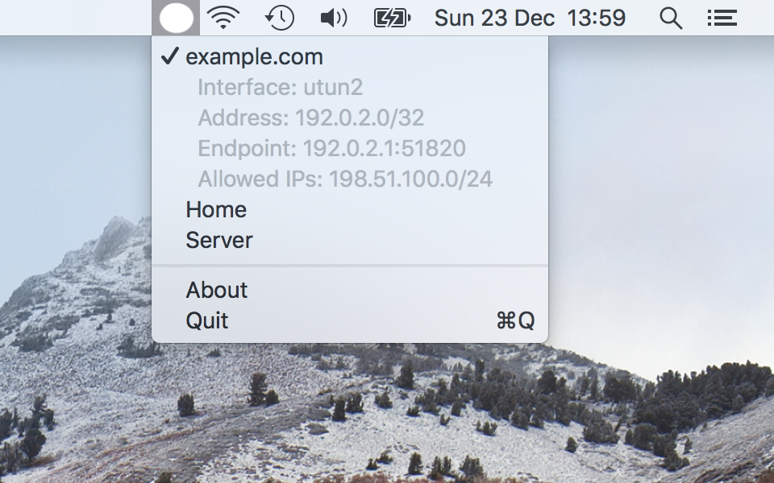

This is a macOS statusbar item (aka menubar icon) that wraps wg-quick.

# Features

- Sit in your menubar
- Indicate if tunnels are connected
- Bring tunnel up/down via one click
- ~~Fail miserably when brew/wg-quick is not installed or permissions on files are incorrect~~

# Installation

- Follow the instruction to install WireGuard for macOS: https://www.wireguard.com/install/
- Create a tunnel configuration file (eg: `/usr/local/etc/wireguard/utun1.conf`)
- Make sure the file is readable by your user (`sudo chown :staff /usr/local/etc/wireguard/utun1.conf; sudo chmod g+r /usr/local/etc/wireguard/utun1.conf`)
- Download this App from [Releases](https://github.com/aequitas/macos-menubar-wireguard/releases)
- Open the .dmg and copy the Application to where you like (eg: /Applications)
- The next bit is needed because I don't have a Apple Developer account to properly sign the binary. If you don't like it consider building and signing the application yourself.
    - Start the App and get a dialog indicating the app is not signed
    - Go to: Preferences->Security & Privacy->General and click "Open Anyway"

# Building & Testing

Automation scripting is provided in this repository to make development a little easier. Primary development using Xcode is supported/preferred but some actions (integration testing, distribution build) are only available using `make`.

To test the project and check code quality run:

    make test

Integration tests require preparation and will ask for a `sudo` password to install a test configuration file in `/etc/wireguard`:

    make test-integration

Code formatting should preferably by done by computers. To auto correct most violations run (this is also run before each `make test` or `make check`):

    make fix

To completely verify/test the project and build a distributable `.dmg` simply run:

    make

# Architecture/Security

- This application is split into two parts. The Application and a [Privileged Helper](https://developer.apple.com/library/archive/documentation/Security/Conceptual/SecureCodingGuide/Articles/AccessControl.html).
- The App will sit in the menubar after launching and handle all UI interaction and logic.
- Whenever the App needs to perform actions requiring Administrator privileges (eg: start/stop tunnel, read configurations) it will communicate with the Helper via XPC to have these actions performed.
- The Helper is installed as a [Privileged Launchd daemon](https://developer.apple.com/documentation/servicemanagement/1431078-smjobbless?language=objc) during the startup of the App. The user will be prompted for credentials during this action.
- Logic/responsability in the Helper is kept to a minimum and communication between the App and the Helper is in simple primitives (eg: tunnelUp("tunnelname")) to reduce attack surface of the Helper.
- The Helper should not allow an unprivileged attacker to perform any actions via the XPC that would not be possible to perform when using the App.
- Both the App and the Helper are signed and these signatures will be verified on Helper installation and XPC communication.
- The Helper will only run when needed.

# License

This software as a whole is licensed under GPL-3.0

"WireGuard" and the "WireGuard" logo are registered trademarks of Jason A. Donenfeld.

# Todo/Readmap

- Tests!
- Tunnel connectivity status
- Move config file reading to privilegedhelper/read configuration using `wg`
- Bundle WireGuard (wireguard-go/wg-quick/bash4)/Drop `wg-quick` for custom route creations (to drop bash4 as requirements and enable advances routing options like excluding local networks from 0.0.0.0/0).
- Preferences
- Recent tunnels on top option
- Active tunnels on top option
- Tunnel configuration augmentation (groups, alt. names, etc)
- Configuration editor
- Key management (via keychain)
- Start tunnels at startup
- Add application to startup items
- More tunnel statistics (privilegedhelper)
- Help menu
- Developer ID signing
- Update checking
